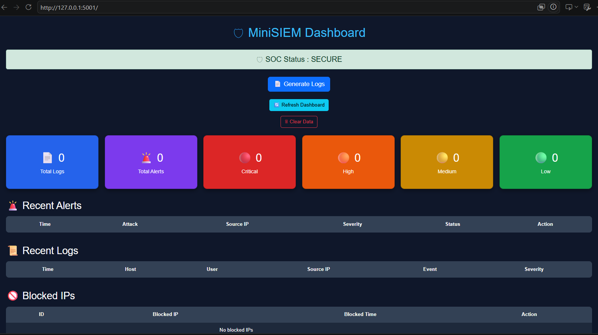
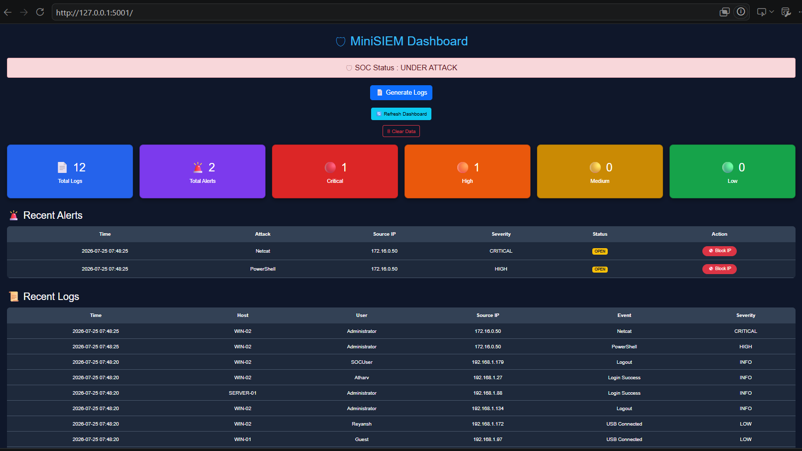
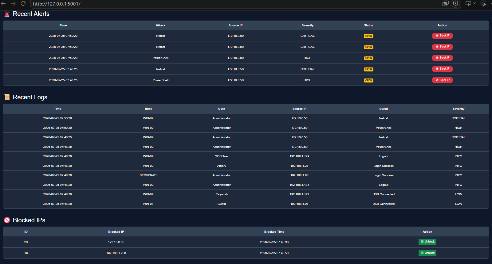

# 🛡 MiniSIEM

A lightweight Security Information and Event Management (SIEM) system built with **Python, Flask, and SQLite**.  
MiniSIEM simulates real-world SOC (Security Operations Center) operations by generating security logs, detecting suspicious activities, creating alerts, and providing a web dashboard for monitoring.

---

## 📌 Features

- 📄 Generate Normal Security Logs
- 🚨 Simulate Brute Force Attacks
- 🌐 Simulate Port Scan Attacks
- 💀 Detect Suspicious Commands (PowerShell & Netcat)
- 🔍 Automatic Attack Detection Engine
- 🚨 Alert Management
- 🛡 SOC Status Monitoring
- 🚫 Block Malicious IP Addresses
- 📊 Dashboard with Security Statistics
- 🗄 SQLite Database Integration
- 🧹 Clear Logs & Alerts

---

## 🛠 Tech Stack

- Python
- Flask
- SQLite
- HTML
- CSS
- Bootstrap 5
- Jinja2

---

## 📂 Project Structure

```
MiniSIEM/
│
├── app.py
├── requirements.txt
├── README.md
│
├── database/
│   └── siem.db
│
├── logs/
│   └── security.log
│
├── modules/
│   ├── database.py
│   ├── detector.py
│   ├── log_parser.py
│   ├── generate_logs.py
│   ├── recommendations.py
│   └── alert_manager.py
│
├── static/
│   └── css/
│
└── templates/
    |── dashboard.html
    |──logs.html
    |──alerts.html
```

---

## 🚀 Installation

Clone the repository

```bash
git clone https://github.com/ReyanshSingh1704/MiniSIEM.git
```

Move into the project

```bash
cd MiniSIEM
```

Create virtual environment

```bash
python -m venv venv
```

Activate virtual environment

### Windows

```bash
venv\Scripts\activate
```

Install dependencies

```bash
pip install -r requirements.txt
```

Run the application

```bash
python app.py
```

Open your browser

```
http://127.0.0.1:5001
```

---

## 🔍 Detection Rules

MiniSIEM currently detects:

- Brute Force Login Attempts
- Port Scanning
- PowerShell Execution
- Netcat Execution

Each detected attack generates:

- Severity
- Recommendations
- Alert Entry
- SOC Status Update

---

## 📸 Screenshots

### Dashboard Overview



### Alert Detection



### Blocked IP Management



---

## 🎯 Future Improvements

- Alert Search
- Email Notifications
- PDF Report Generation
- Interactive Charts
- User Authentication
- Threat Intelligence Integration

---

## 👨‍💻 Authors

**Reyansh Singh,**
**Abhyuday Arya and**
**Atharv Jain**

---

## ⭐ Support

If you found this project helpful, consider giving it a ⭐ on GitHub.